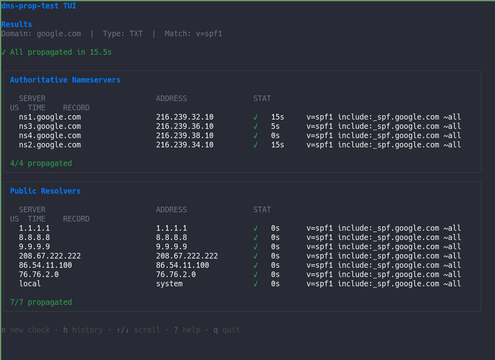
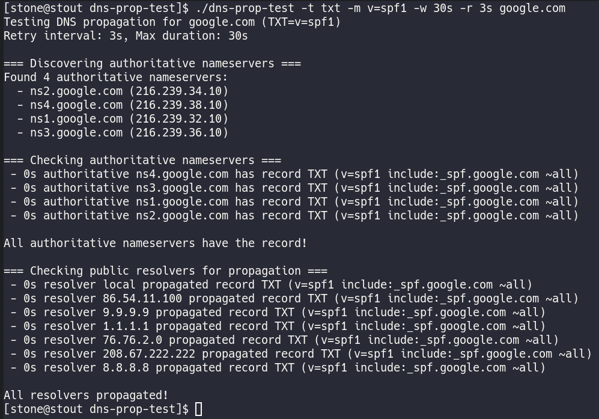
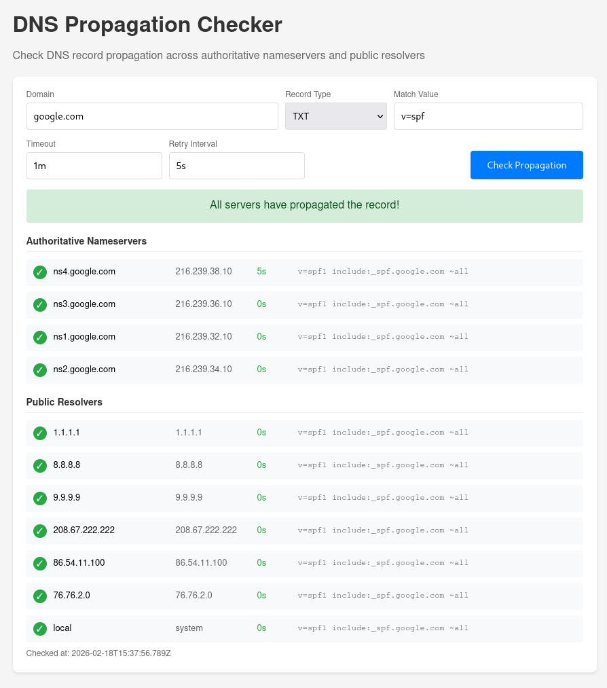
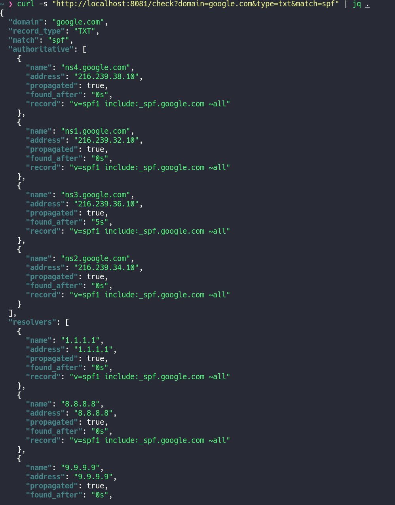

# ripple

DNS propagation checker. Walks the DNS tree from root servers, finds all authoritative nameservers for a domain, then polls them (and a set of public resolvers) until the record shows up or a timeout is hit.

Three modes: CLI for scripting/piping, a TUI for interactive use, and an HTTP server with a web UI.

## Usage

```sh
# wait for an A record to appear
ripple -t a -m 1.2.3.4 example.com

# check a TXT record with custom timing
ripple -t txt -m "v=spf1" -w 2m -r 3s example.com

# interactive TUI
ripple -tui

# web UI + API
ripple -serve :8080
```

## Screenshots

**TUI**



**TTY / CLI output**



**Web UI**



**API**



## Install

```sh
go install .
```

Or build manually:

```sh
make build
```

Static binary (for containers/k8s):

```sh
make build-static
```

Docker:

```sh
make docker-local
docker run --rm -p 8080:8080 ripple -serve :8080
```

## Config

Copy `config.example.yaml` and pass it with `-c`:

```sh
ripple -c config.yaml -serve :8080
```

The config lets you set default timeouts, the resolver list, and the root servers used for NS traversal.

## HTTP API

```
GET  /check?domain=example.com&type=a&match=1.2.3.4
POST /check  {"domain":"...","type":"txt","match":"...","timeout":"1m","retry":"5s"}
GET  /check/stream?...   (SSE, used by the web UI)
GET  /health
```

## Helm

```sh
# Install
helm install ripple oci://ghcr.io/stone/charts/ripple --version 0.1.2

# With ingress enabled
helm install ripple oci://ghcr.io/stone/charts/ripple --version 0.1.2 \
  --set ingress.enabled=true \
  --set ingress.hosts[0].host=ripple.example.com

# Upgrade
helm upgrade ripple oci://ghcr.io/stone/charts/ripple --version 0.1.3
```

The chart deploys ripple in HTTP server mode (`-serve`). Override `config.*` values to adjust resolvers, timeouts, or the listen address.

## Record types

`a`, `aaaa`, `txt`, `cname`, `mx`
